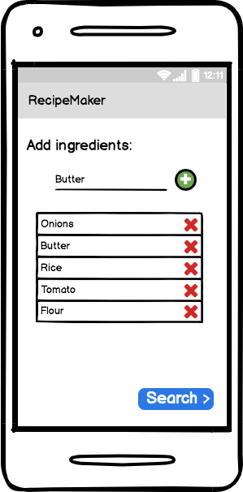
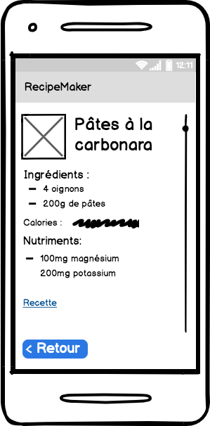
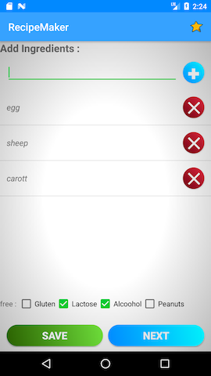
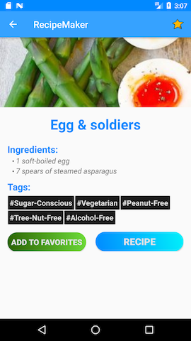
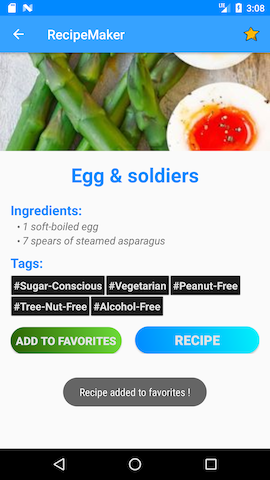
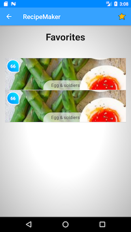

# RECIPE MAKER

## auteurs
 + Caikozolyv  - Valentin
 + Babousse - Maxime
 + arnaud - moi

## Cahier des charges

Application android de recherche de recettes.

Recipe Maker permet d'interroger le service Web d' EDAMAM afin d'obtenir des recettes en fonction
de d'ingredients qui nous sont disponibles.

## Iteration I
Dans la premiere version l'application permettra de :

- Saisir un ingredient
- Ajouter/supprimer cet ingredient dans une liste
- Requeter Edamam en fonction de cette liste d'ingredients
- Afficher la liste des recettes reçues
- Cliquer sur un item de cette liste pour en afficher le details
- Afficher le détails de la recette
  - Titre
  - Photo du plat
  - Liste d'ingredients
  - Lien vers le pas à pas de la recette
- pour l'ensemble des pages une fleche propose un retour arriere

## Mockup Balsamiq
### Search Activity

### List Activity

### Details Activity

## Iteration II
- Ajout d'un Loader

- Dans la SearchActivity :
    - un boutton permet d'enregistrer la derniere recherche
    - refonte du design

- Dans la listActivity :
  - refonte du design
  - affichage des calories dans une pastille

- Dans la detailsActivity
  - Un icon favoris permet de sauvegarder les recettes favorites
  - refonte du design
  - Creation d'une activity favoris

